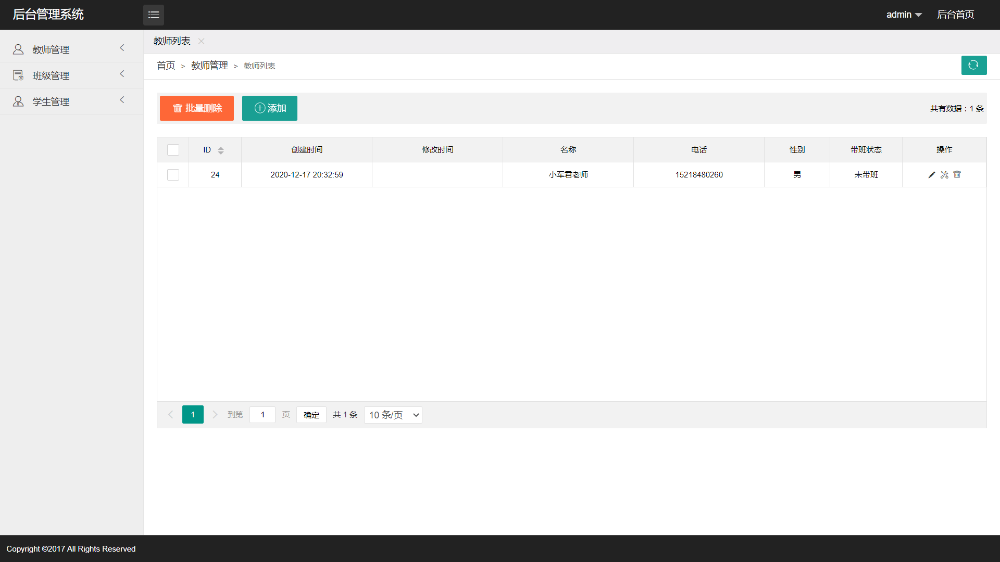
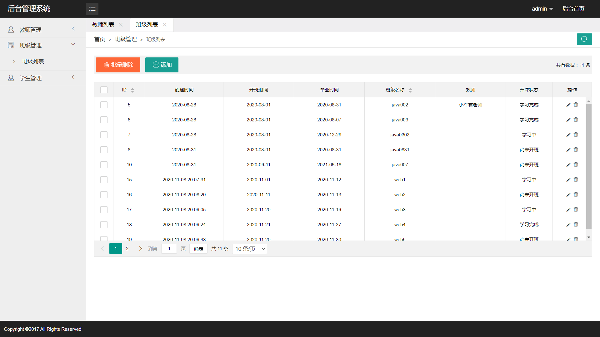

# 班级管理系统（前端）

#### 介绍
本项目为学习与练习项目，实现一个简单的班级管理系统练习 C3P0 数据库连接池的使用步骤。主要功能包括班级管理、教师管理以及学生管理。

#### 链接
班级管理系统：[http://m.yongkj.cn/html/class/](http://m.yongkj.cn/html/class/)

#### 截图

#### 技术栈
MySQL+Servlet+C3P0+JDBC

1.  数据处理采用Java Web中的Servlet容器技术完成
2.  使用 PreparedStatement 拼接条件查询语句防止 SQL 注入
3.  后台的数据存储主要采用开源的Mariadb数据库来完成

#### 功能特性

1.  班级、教师以及学生信息的增加、删除、修改
2.  点击页面的刷新按钮即可刷新当前展示的表格数据

#### 使用说明

1.  edu_chinasofti.sql 为数据库备份文件
2.  可在 src/com/yongkj/manage/dao/C3P0Utils.java 文件中修改数据库连接信息
